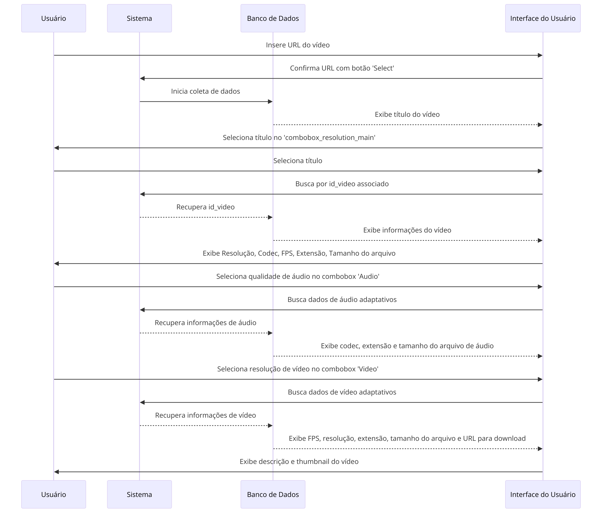
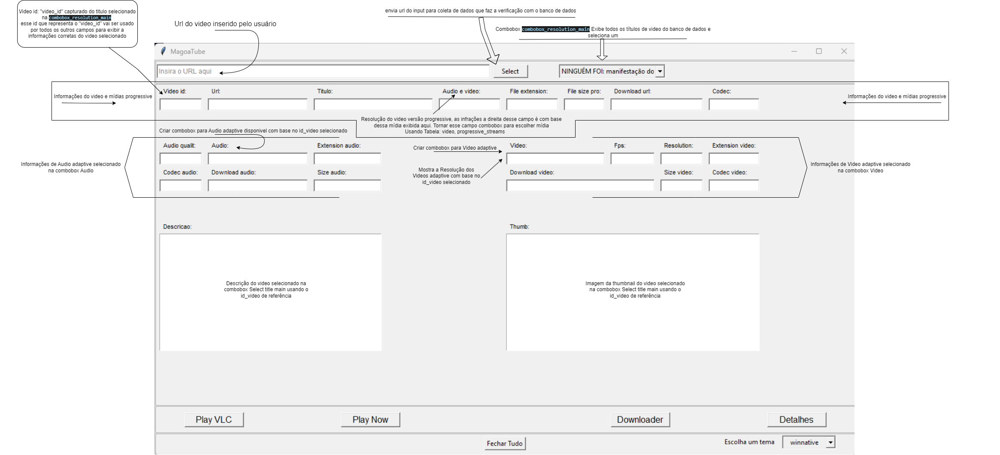

# Documentação do Projeto

## Índice

- [Documentação do Projeto](#documentação-do-projeto)
  - [Índice](#índice)
  - [Estrutura do Projeto](#estrutura-do-projeto)
    - [Pasta Raiz](#pasta-raiz)
    - [Pasta "modules"](#pasta-modules)
  - [Estruturas de Tabelas 📋 do Banco de Dados 💽](#estruturas-de-tabelas--do-banco-de-dados-)
    - [📋 TABELA: progressive\_streams](#-tabela-progressive_streams)
    - [📋 TABELA: adaptive\_streams](#-tabela-adaptive_streams)
      - [Campos Adaptive Video](#campos-adaptive-video)
      - [Campos Adaptive Audio](#campos-adaptive-audio)
  - [Lógica Geral de Coleta de Dados URL](#lógica-geral-de-coleta-de-dados-url)
    - [Processo de Coleta de Dados](#processo-de-coleta-de-dados)
  - [Passo a Passo da Lógica para Exibição dos Dados](#passo-a-passo-da-lógica-para-exibição-dos-dados)
    - [🛑 Documentação em construção junto com o desenvolvimento do código](#-documentação-em-construção-junto-com-o-desenvolvimento-do-código)

## Estrutura do Projeto

  
🧬 Estrutura de arquivos [Clique aqui 👈]

<pre>
🗃️ MagoaTube/
├── 📚 MagoaTube.code-workspace
├── 🗄️ dados.db
├── ⚙️ path_config.json
├── 📝 doc.md
├── 🐍 main.py
├── 🐍 main_screen.py
└── 🛠️ modules/
    ├── 🐍 Transcrever_Youtube.py
    ├── 🐍 __initi__.py
    ├── 🐍 check.py
    ├── 🐍 check_monitor.py
    ├── 🐍 data_video.py
    ├── 🐍 data_view.py
    ├── 🐍 db_original_add.py
    ├── 🐍 manager_db.py
    ├── 🐍 path_tree.py
    ├── 📁 downtube/
    └── 🗂️ play_tube_vlc/
        └── 🐍 main_TubeVLC.py
</pre>

### Pasta Raiz

- **main.py**
  - *Descrição*: Responsável por executar o código e pelo loop principal.
- **main_screen.py**
  - *Descrição*: Responsável pela exibição da tela principal e chamadas na tela principal.

### Pasta "modules"

- **manager_db.py**
  - *Descrição*: Comunicação com o banco de dados e funções relacionadas.
- **data_video.py**
  - *Descrição*: Coleta e organização de dados do vídeo.
- **check_monitor.py**
  - *Descrição*: Verificação de resolução de monitores.
- **data_view.py**
  - *Descrição*: Widgets para exibição de informações do banco de dados na UI.
- **path_tree.py**
  - *Descrição*: Identificação de pastas e endereços específicos do projeto.

## Estruturas de Tabelas 📋 do Banco de Dados 💽

### 📋 TABELA: progressive_streams

📊 Tabela progressive_streams 💽 [Clique aqui 👈]

| Campo            | Descrição                                                                         |
|------------------|-----------------------------------------------------------------------------------|
| Video id         | video_id na tabela é que liga varias linhas de informação ao mesmo video          |
| Url              | é o link de origem do video                                                       |
| Título           | titulo do video                                                                   |
| Audio e video    | lista de resolução mídia disponível: audio e video em um só arquivo progressive,  |
| File extension   | resolução da mídia progressive escolhido                                          |
| File size pro    | tamanho do arquivo da mídia progressive escolhido  |
| Download url     | link de download da mídia progressive escolhido    |
| Codec            | tipo de codec usado na mídia progressive escolhido    |
| Descrição        | descrição do video    |
| Thumb            | thumbnail do video    |

### 📋 TABELA: adaptive_streams

📋 Campos Adaptive Videos 💽 [Clique aqui 👈]

#### Campos Adaptive Video

| Campo          | Descrição |
|----------------|-----------|
| Video          | Lista de Resoluções mídia de video adaptive para selecionar   |
| Download video | link para download do video adaptive selecionado          |
| Fps            | mostra fps do video adaptive selecionado           |
| Extension video| extensão do arquivo de video adaptive selecionado           |
| Size video     | tamanho do arquivo de video adaptive selecionado           |
| Codec video    | Codec utilizado no video adaptive selecionado           |

📋 Campos Adaptive Audio 💽 [Clique aqui 👈]

#### Campos Adaptive Audio

| Campo           | Descrição |
|-----------------|--------------------------------------------------|
| Audio           | Lista de audio adaptive para selecionar          |
| Audio quality   | qualidade do audio adaptive selecionado em kbps          |
| Extension audio | extensão de audio adaptive selecionado         |
| Codec audio     | Codec utilizado no audio adaptive selecionado          |
| Download audio  | link de download do audio adaptive selecionado          |
| Size audio      | tamanho do audio adaptive selecionado          |

## Lógica Geral de Coleta de Dados URL

### Processo de Coleta de Dados

1. **Início do Processo**: 
   - *Arquivo*: `main_screen.py`

2. **Extração de Informações do Vídeo**: 
   - *Arquivo*: `data_video.py`

3. **Inserção/Verificação no Banco de Dados**: 
   - *Função*: `insert_video_info`

## Passo a Passo da Lógica para Exibição dos Dados

  
📅 Diagrama de Exibição de Dados 💾 [Clique aqui 👈]

  <pre>
    
  </pre>

📅 Diagrama Exibição e funcionamento Detalhes Video 📝 [Clique aqui 👈]

  <pre>
    
  </pre>

### 🛑 Documentação em construção junto com o desenvolvimento do código

<!-- Coloque este HTML no final do seu documento Markdown, ajustando o tamanho do emoji com `font-size` -->

    <a href="#topo">🔝</a>

